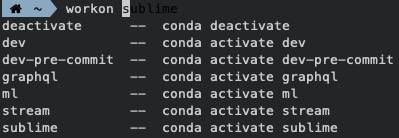

# Zsh Autosuggestion: workon ❤️ conda


Simple tool for lazy baster :stuck_out_tongue_winking_eye:




## Oh My Zsh

1. Clone this repository into `$ZSH_CUSTOM/plugins` (by default `~/.oh-my-zsh/custom/plugins`)

   ```zsh
   git clone https://github.com/benbenbang/zsh-conda-workon.git ${ZSH_CUSTOM:-~/.oh-my-zsh/custom}/plugins/workon
   ```

2. Add the plugin to the list of plugins for Oh My Zsh to load (inside `~/.zshrc`):

   ```
   plugins=(workon)
   ```

3. Copy paste the snippet into you `.zshrc` or do:
    ```zsh
    curl -Ls https://raw.githubusercontent.com/benbenbang/zsh-conda-workon/master/zshrc | xargs >> .zshrc
    ```

4. Start a new terminal session.